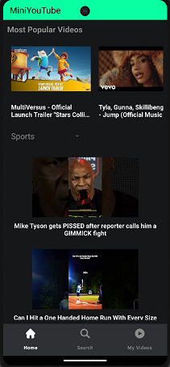
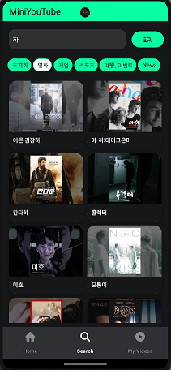
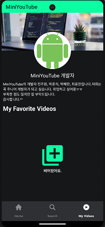
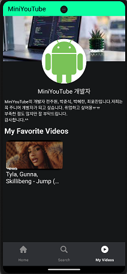
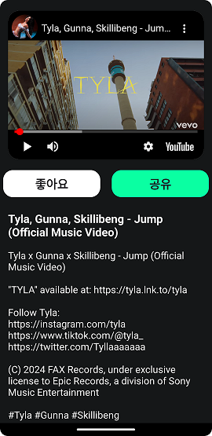

# MiniYouTube

## ✨주제

- 유튜브에서 제공하는 API를 통해 원하는 동영상을 검색하고 저장 및 실행 가능한 앱

## 💻주요 기능


### Home페이지

- 가장 인기 있는 동영상 정보 제공
- 카테고리별 동영상 정보 제공

### Search페이지

- 모든 동영상 검색
- 특정 카테고리별 동영상 검색

### MyVideos페이지
- 저장된 동영상 정보 제공 및 삭제

### VideoDetail페이지
- 동영상의 상세 정보 제공
- 동영상 저장 및 삭제
- 동영상 실행


## ⚙ 트러블 슈팅


### YouTub API 공식 문서 내용 이해
- 문제: 유튜브 공식 문서가 너무 불친절해서 이해하는데 어려움이 있었습니다.

- 해결: 여러 예제를 찾아보면서 실제 매개변수가 값이 어떤 것을 뜻하고 있는지 알아봐야 했습니다.

### RecyclerView의 페이징 기능 구현 중 데이터 누수 발생

- 문제: recyclerView의 setOnScrollChangeListener를 이용하여 페이지 시점을 잡다보니 무분별한 데이터 호출로 데이터 누수 발생

- 해결: addOnScrollListener를 통해서 상태를 감지하여 문제 해결


### 서로 다른 RecyclerView에 뿌려줄 데이터에 대한 ViewModel 로직 문제 

- 문제: 서로 다른 RecyclerView가 같은 LiveData를 observe하다 보니 같은 데이터를 계속 보여줌

- 해결: enum class를 통한 분기 처리와 2개의 각각의 LiveData를 생성하므로써 로직 문제 해결

### RoomDB의 컬럼 값 변경으로 인한 에러 발생

- 문제: RoomDB의 스키마 값 변경 후 해당 RoomDB의 버전 업데이트 및 이전을 해주지 않아 발생
  ```
  //아래는 에러 문구
  Room cannot verify the data integrity. Looks like you've changed schema but forgot to update the version number. You can simply fix this by increasing the version number.
  ```
  
- 해결: 
  - Android 설정에서 앱 자체를 삭제해서 앱 데이터를 지우기 (방법1)
  - 데이터베이스 버전을 증가시키는 경우 → 데이터베이스 마이그레이션 코드를 작성해주기 (방법2)

- 방법1 선택: 아직 배포 중인 아닌 앱이기 때문에 그냥 앱을 삭제해서 RoomDB를 날려버리고 다시 설치 해서 해결함

## 스크린샷
  
 

## 🔗시연영상
<https://youtu.be/DsQHFFT40QQ>